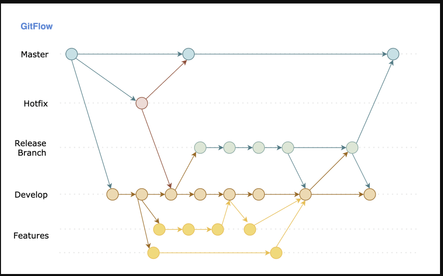
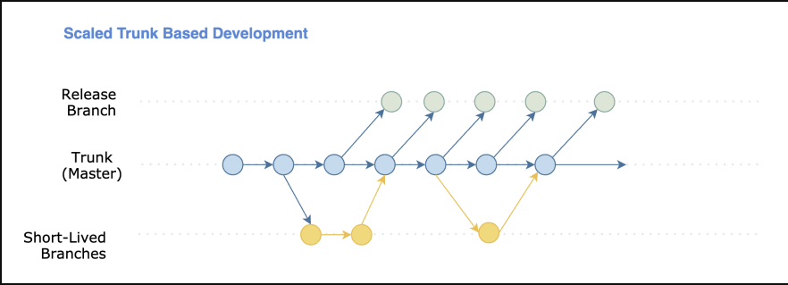

# Curso: GIT+GitHub: Todo un sistema de control de versiones de cero

### TERMINADO 2023-02

Curso de: [GIT+GitHub por Fernando Herrera](https://www.udemy.com/course/git-github/)

# CONCEPTOS Y DEFINICIONES

Git es un sistema de control de versiones distribuido, lo que significa que un clon local del proyecto es un repositorio de control de versiones completo. Estos repositorios locales plenamente funcionales permiten trabajar sin conexión o de forma remota con facilidad. Los desarrolladores confirman su trabajo localmente y, a continuación, sincronizan su copia del repositorio con la copia en el servidor. Este paradigma es distinto del control de versiones centralizado, donde los clientes deben sincronizar el código con un servidor antes de crear nuevas versiones.

**Ref:** [Que es Git: AzureDevOps](https://learn.microsoft.com/es-es/devops/develop/git/what-is-git)

## Repositorio Local

Copia local del repositorio (archivos de trabajo) por cada version nueva o cambios que se hayan hecho.Se puede trabajar con git de esta manera.

## Repositorio Distribuido

Copia del repositorio en un servidor externo de todos los archivos con todos los cambios realizados, esta es la manera como Git funciona. ej: GitHub, GitLab.

## Stage

Es el espacio de trabajo temporal donde se van guardando los cambios a los archivos con seguimiento. No estar en el stage sigfinica que los archivos en cuestion no tiene seguimiento.

## Apuntador

Es la referencia de donde se encuentra ubicado actualmente en el tiempo. generalmente el apuntador siempre apunta a HEAD.

## Commit

Se usa para para guardar el estado actual de todos los archivos en el stage sin cambios guardados. El commit es como un screenshot el cual se identifica mediante un hash y se pueden agregar comentarios a los commits.

Regresar a un commit anterior restauraria todos los archivos a ese estado y eliminaria los que no estan. Esto significa que el apuntador se mueve a ese commit.

## Upstream

Repositorio original del cual se hizo fork

## Tags

Son etiquetas que ahcen referencia hace un commit y a todo el estado del proyecto en ese punto.
    - Los tags se ven en el log, el tag siempre va a apuntar al commit donde se crea el tag
    - Los tags no se cargan al repositorio con push, es necesario hacerlo manualmente
    - Con los tags en GitHub se puede descargar un .zip del proyecto en ese estado, no descarga la información de git.

## Ramas

Una rama o branch es una versión del repositorio (temporal y espacial) desde un commit en especifico lo cual crea una bifurcación de este que a su vez es como si fuera un repositorio a parte,el cual sirve en la practica para desarrollar cosas diferentes que afecta el proyecto paralelamente pero los cambios se realizan sobre otra rama distinta a la principal. Luego se pueden introducir los cambios a otras ramas o a la rama principal con uniones.

- La rama principal es: **main**
- Los commit se comparten entre todas las ramas
- Inicialmente el HEAD apunta al main y a la nueva rama
- Cuando hay un commit nuevo el HEAD apuntaria a la rama con de ese commit

## MERGE (unión) de Ramas y Conflictos

Al unir las ramas a demas de introducir cambios a la rama principal, tambien se agregan los commits que se hayan hecho. Git siempre intentará resolver el merge de manera automatica.

- **Fast-forward**: Unión rapida se da cuando git no encuentra ningun commit en la rama principal y los cambios de la otra rama pueden ser incorporados sin problema.

- **Automaticas**: Unión automatica se da cuando git detecta que en la rama principal hubieron cambios que no estan presentes en la otra rama pero no se cruzan en los mismos lugares en los archivos con cambios en la otra rama.

- **Manual**: Unión manual se da cuando se deben hacer ajustes manualmente a los archivos cuyos cambios estan en conflicto entre la rama principal y la otra rama. La solución del conflicto crea un commit llamada *Merge Commit*.

## Rebase

Similar a *merge*, sirve para *fusionar* cambios de una rama en otra con la diferencia que los commits introducidos puedes ser reorganizados para mantener un historial lineal, esto coloca el apuntador en el commit mas reciente de la rama de donde se tomaron los cambios. En la practica lo que hace rebase es agrega los cambios a la otra rama y luego agrega los cambios que se hicieron en esa rama de tal manera que al final se tiene como si la otra rama estuviera actualizada con la rama principal y ya tuviera los cambios adicionales de la misma rama (otra rama).

Sirve para:

- Ordenar commitsq
- Corregir mensajes de los commits
- Unir commits
- Separar commits
- Es util para evitar conflictos en un merge, si ya se hizo un rebase desde otraRama rebase main, al hacer merge con otraRama no habrian conflictos por lo que resulta en fast-foward.

## Rebase manual

Cuando se usa el comando `git rebase main`

## Rebase interactivo

De maneta interactiva en un mení se decide que hacer, las opciones son:

- reword: renombrar commit
- edit: editar commit, permite editar archivos del commit o agregar mas commits
- squash: unir dos commits, seleccionado y git toma el anterior
- drop: eliminar commit

## Stash

Se usa para guardar todos los cambios que aún no estan en el stage luego del último commit en otro lugar dejando de esta manera todo el repositorio en el mismo estado del último commit, posteriormente se pueden unir estos cambio, cuando se unen estos cambios del stash el stage los va a reconocer como cambios sin guardar. Se pueden crear stash con nombres y estos se apilan entre si.

- Esto es util cuando se requiere coninuar con el trabajo tal cual como esta en el último commit.
- Los stash pueden crearce con nombres
- Los stash se ven en el log y tiene su hash similar a un commit
- Los stash se ven como bifurcaciones en el log, cuando se restaura tambien se elimina del log siempre y cuando haya generado conflictos
- Cuando se restaura desde el stash resolviendo conflictos en la pila de stashes queda un resgistro que se puede borrar
- Cuando se restaura un stash puede ocasionar conflictos, por lo que se deben solucionar

## (POP) unión desde Stash y Conflictos

Al unir los cambios desde el stash se pueden presentar conflictos de la misma manera que en el merge de ramas. Git siempre intentará resolver el merge de manera automatica.

- **Fast-forward**: Unión rapida se da cuando git no encuentra ningun conlicto.

- **Automaticas**: Unión automatica se da cuando git detecta que los mismos archivos fueron modificados pero no en las lismas lineas.

- **Manual**: Unión manual se da cuando se deben hacer ajustes manualmente a los archivos cuyos cambios estan en conflicto entre. Se soluciona de la misma manera que un *Merge Commit*.

## Proyecto

Es el area donde estan todos los archivos con los cuales se trabajan.

## Repositorio

Es el lugar en la nube donde se almacenan un repositorio. Al ser centralizado y accesible se presta para poder hacer uso colaborativo, varias personas puedes cargar una copia y subir los cambios. Servicios en la nube colaborativos que usan como git: GitHub, GitLab, BitBucket, Gitosis

## Pull

Trae los datos, ferencias y en general todos los cambios del proyecto en el respositorio al proyecto local. Esto puede traer conflictos.

- *Pull Request* o *Merge Request* Es la solicitud de un usuario que quiere unir los cambios de una rama secundaria con la rama principal del repositorio para que sea revisada y aprobada o rechazada, esta solicitud debe ser gestionada por un administrador.
  - Aprobada
  - Rechazada

## Push

Envía los datos y cambios del proyecto local a el respositorio.

## Pull Rebase

Se da cuando al hacer un pull no se puede lograr *fast-forward* y es necesario usar pull rebase.

- Mensaje: *fatal: No es posible hacer fast-forward, abortando*

## Fetch

Actualiza solo las referencias del proyecto desde el repositorio, esto no descarga archvios, solo cambios relacionados con el historial. Esto sirve para saber si hay cambios evitando asi que en caso de haber cambios se tenga que hacer un merge.

# Soporte Legacy

Cuando un programa queda sin soporte u obsoleto y el cliente desea agregar cambios o dar soporte adicional, esta forma de soporte se llama Soporte Legacy. Para esto se recomienda

- crear otra rama desde main
- crear tags para llevar control de los releases
  - tambien sirve en caso de que se borre la rama, se pueden ver los cambios con el tag que apunta a la rama o con el zip que se genera

***

# GitHub

1. En los commtis o commits de los tags se puede ingresar, ver los cambios ya gregar comentarios. Estos comentarios pueden contener archivos y nombrar a alguien.
2. Se pueden usar Releases y Pre-Releases para publicar grandes cambios, esto tambien crea una url para cada Release. Se puede colocar un Release en particular como el último Release.
3. Se pueden editar el tag para agregar un mensaje y así crear un Realase. Tambien se puede hacer con el bonton de Create Release from Tag.
4. Se puede realizar Fork de otros repositorios
   1. Para agregar cambios al repositorio original, desde Github se va a Contribuir > Abrir Pull Request >> seleccionar la rama de origen y la rama de destino
   2. en Github existe la opcion de Fetch upstream > **Fetch and merge** cuando el repositorio original tiene cambios, otra alternativa es hacerlo manualmente
5. En el repositorio se pueden ver los Pull Request e Issues
   1. Desde Github: Crear archivo > seleccionar new branch for this commit y start a pull request > propose new file >> seleccionar rama
   2. Se acepta: Merge commit (unir y crear un commit), Squash and merge (se fusionan los cambios con el ultimo commit y hace merge), Rebase and merge.
6. En Issues se pueden crear labels para ayudar a indentificar el tipo de problemas, Issues>Labels>New Label
7. Los Actions, son acciones que se pueden automatizar como por ejemplo para hacer despliegue continuo
8. Porjects tiene lo necesario para toda la parte de planeación, no sería necesario usar mas herramientas
9. Wiki permite crear documentación al proyecto en el repositorio
10. Security permite aisgnar a ciertos usuarios para revisar la seguridad de la aplicación, tambien permite crear reportes y verlos en este apartado
11. En Ingights se pueden ver metricas como: usuarios quecontribuyen, cantidad de commits por usuario, ancho de banda usado, cantidad de forks realizados, frecuancia de codigo x dia, dependecias (librerias) que se usan en el repositorio
12. Con *Go to file* pueden ver todos los archivos e ir rapidamente a alguno
13. Se puede cambiar entre ramas con Branches
14. Opciones de los archivos:

- Crear
- Eliminar
- Editar
- Copiar contenido RAW
- Con *Goto line* ir a una linea del archivo
- Copiar path (relativo)
- Copiar path permalink (url completa en github.com)
- RAW - ver contido RAW
- Blabe - que cambios ha sufrido el archivo y quien hizo los cambios
  - View Blabe para colocar todo el respositorio en un commit especifico
- Hisotorial - ver los commits que ha tenido y sus cambios

## Seguridad en Github

1. Personal Tokens
   1. Token que al usarla habilita funciones especificas desde otras fuentes, el token tiene permisos especificos para configurar
   2. Tambien se puede usar como password en la autenticación al clonar o hacer pull
2. SSH Keys: Llave que almacena el SO para evitar iniciar sesion en github.com con credenciales para relizar alguna acción, ej: clonar repositorio y pull
3. GPG Keys: Llave que almacena el So y permite firmar y autenticar los commits que se hacen, en github aparece el commit con *verified*

# Buenas practias de trabajo en GitHub (basico)

1. No hacer cambios sobre main
    - cada miembro del equipo crea su propia rama (feature branch)
    - cada miembro puede ver el tabajo del resto con `git checkout rama-otro`
2. Trabajo Colaborativo
    - Tener colaboradores
    - Usar el Milestone e Issues
    - Usar Usar Pull Request
    - Asignar a un equipo de trabajo de hacer estas revisiones del pull request
    - Discutir y comentar los cambios antes de aprobar o rechazar
    - Preferible no hacer cambios en la rama de otro miembro
3. Luego de realizar la unión de cambios borrar la rama secundaria

## Clone

Comando de Git que se utiliza para apuntar a un repositorio existente y crear un clon o una copia del repositorio de remoto en nuestra maquina local.

- Si es el repositorio el publico podriamos clonar el repositorio, modificarlo, agregar commits pero no podria hacer un push

## Fork

Crea un clon de un repositorio remoto existente en GitHub a nuestra cuenta como si fuera otra rama (o una version alternativa) para poder ser modificado como propio, esto tambien contiene todos los commits e historial que se haya hecho con el repositorio.

- Con Pull Request se pueden enviar los cambios realizados al repositorio original para que sean revisados por los dueños
- En las solicitudes de Pull Request se pueden agregar comentarios tanto del dueño del repositorio como del que hizo el fork
- Estados por colores cuando de los solicitudes que tengo
    1. Verde: Pull Request solicitado
    2. Morado: Pull Request ya aceptado
    3. Rojo: Pull Request rechazado
- Cuando yo tengo un fork con cambios pero luego de un tiempo el upstream tiene nuevos commits y quiero agregar esos cambios debo agregar cambios del upstream o en github hacer fetch upstream

## Organizaciones

**Muy util para colaboraciones** las organizaciones son cuentas compartidas, donde se agregan repositorios y colaboradores, estos colaboradores pueden estar en varias organizaciones a su vez.

- es como si fuera una cuenta independiente compartida
- util para tener un espacio donde van a haber muchos repositorios y se quieren usar los mismos equipos de trabajo o cambiarlos
  - en caso contrario cada que se crea un repositorio se debe agregar a cada miembro siempre a cada repositorio y configurar sus roles
- Cada miembro inicia sesion con su cuenta persola para acceder a la orgnizacion
- las organizaciones tienen roles y se pueden definir
- se pueden invitar a miembros para colaborar
- util para limitar el trabajo en alguien nuevo que colabora en un proyecto
- se pueden quitar limitaciones o potenciar caracteristicas pagando las opciones en Github
- se puede personalizar el perfil de la organizacion

## Teams (de organizaciones)

Son equipos de trabajo como si fuera una organización pequeña que se crean dentro de la organización para facilitar la comunicación, se deberian crear los equipos de trabajo que tiene la empresa en la vida real: desarrolladores jr, desarrolladores sr, testers,...etc \

Para habilitar las opciones primero se debe

1. crear la organizacion
2. crear los teams dentro de la organizaciión
3. dentro del team ir a repositories > add repositorio
4. asi se asignará el team al repositorio

**Opciones disponibles** \

- se pueden referenciar como si fuera un miembro
- se pueden invitar a personas de todo github
  - osea que no necesariamente tiene que estar dentro de la Organizacion
- se pueden agregar permisos a los miembros del team
- se pueden crear discusiones y publicaciones
- dentro de un team se pueden agregar teams
- los permisos del team se heran a todos los miembros
- permisos del team en un repositorio:
  - read (clonal y comentar)
  - triage (read con algunas limitaciones)
  - write (read+pull request)
  - maintain (read+write)
  - admin (todos los permisos y configuraciones)

## Colaboradores

Se pueden agregar otros usuarios de GitHub como colaboradores, de tal manera que los colaboradores tienen los mismos privilegios que los propietarios del repositorio/codigo pero no sobre sus configuraciones.

- para agregar colaboradores
  - settings > collaborator & teams >

## Milestone (Hitos)

Agrupa varios issues en Milestone segun los criterios que se le den, sirve para hacer mas facil hacer el seguimiento de los issues en un proyecto

- En la pestaña Milestones creados y dentro todos los issues que lo referencian
- Muestra el % del issues resueltos del Milestone
- se puede agregar fecha al milestone para tener presente la fecha de terminacion
  - editar > due date > save

## Labels (etiquetas)

Etiquetas que ayudan a organiar los issues, se pueden editar, eliminar y agregar

- En el template de los issues se pueden agregar varios labels que se asignan automaticamente cuando se crea con el template

## Issues

Son todas aquellas cosas que pueden ser: problemas reportados, preguntas generale y solicitud de nuevas caracteristicas

- se pueden eliminar (NO RECOMENDADO)
- se pueden asignar a un miembro
- se pueden ordenar y filtrar
- se pueden agregar labels y milestones
- si el issue tiene opciones con checkbox se pueden crear issues nuevos a partir de estos
- los issues no se puden borrar
- se pueden cerrar/resolver issues con comentarios
- se pueden relacionar issues con commits
  - se agrega un comentario de la linea que cambio en el comit y se pone #n del issue
  - se puede agregar en el comentario del issue el hash del issue
- se pueden cerrar/resolver issues con commits
  - cuando se haga el commit colocar "Fixes #n: mensaje": `git commit -am "Fixes #4: mensaje"`
- se pueden agregar templates a los issues, configuracion > issues > set up template >> Add Template >> se edita >> propose changes > Commit changes

## Wikis

Permite tener documentación o lugar como si fuera una pagina web. Puede usar el wiki de su repositorio para compartir contenido.

- Solo disponible con GitHub de pago (febrero 2023)

## Proyectos

Funcionalidad similar a JIRA donde se tiene una colección de elementos (su estado0 se mantiene actualizado), con los proyectos se pueden realizar el seguimiento de incidencias, solicitudes de incorporación de cambios e ideas/comentarios. Se pueden agregar campos personalizados y vistas (tablero, tabla).

- se pueden agregar estados personalizados
- se pueden crear items
- se puede convetir un item en un issue en un repositorio
- se puede relacionar un item con un issue existente

## GitHub Pages

GitHub Pages es un servicio de alojamiento de sitio estático que toma archivos HTML, Markdown, CSS y JavaScript desde un repositorio en GitHub para permitir publicar un sitio web, se puede desplegar el sitio siempre y cuando no requiera codigo de servidor.

- usar un repositorio cualquiera como mini sitio web
  - repositorio > configuraciones > pages
    - seleccionar rama
    - seleccionar folder, ej: /docs
    - save, esperar algunos minotos
    - luego volver y consultar la url: <https://organizacion-nombre.github.io/repo-nombre/>
    - ej: <https://repositorios-de-estudio.github.io/11-avengers-master/>
- util para crear un portafolio en el perfil de usuario

## Insights (metricas)

Ayuda a ver quienes hacen que, cuando, que tanto e interacciones generales con el respositorio

- Pulse: Actividad/Metricas generales, issues, commits, pull requests
- Contributors: Contribuyentes de codigo, quienes y cuantas lineas
- Community:
- Traffic:
- Commits:
- Code frecuency:  tiempo vs cantidad de commits
- Dependency Graph: paquetes o dependencias que usa el repositorio
- Network: Grafico de los commits mas recientes sobre las ramas
- Forks: quienes han hecho fork del repositorio

# Gist

Es un espacio similar a un repositorio en github para compatir codigo y conocimiento en general o fragmentos de codigo.

- se crea en el perfil publico > + > new gist
  - agregar descripcion, nombre del archivo y cuerpo con el codigo, luego guardar publico o privado
- siempre son publicos
  - se pueden colocar secretos pero siguen siendo publicos (no estan indexados en github)
- se pueden descargar, clonar y hacer fork al igual que un repositorio
- util para subir codigo reutilizable
- existen plugins para insertar codigo desde un gist en un editor de codigo
  - util para usar como snipets
  - usar en vscode, se debe tener *personal token* de acceso en githuib con permisos *gist*
    - extension Gist - Ken Howard
    - configurar: ctrl+shif+p > gist: select profile > agregar token de github
    - usar:: ctrl+shift+p > gist: open, seleccionar codigo de la lista que se abre
- al marcar como extrella un gist que no es mio aparecen ahora en la lista de gist disponibles en vscode
- [Mi Gist](https://gist.github.com/sergioPerez-e)

***

# Metodologías o Flujos de trabajo con ramas Git

Es la manera de como se administran las ramas y releases, espeficando como se integra el codigo en el desarollo hasta llegar a la rama de producción.

## Gitflow

Flujo de trabajo que permite estructurar de forma eficiente las ramas del repositorio de git. Esta es una metodologia muy fuertemente escructurada

1. Caracteristicas y ventajas
   1. Ideal para proyectos con un ciclo de publicación programado
      1. Por ejemplo en releases de scrum
   2. Cada determinado tiempo se deben entregar nuevas funcionalidades
   3. Equipos de trabajo para mas de 2 personas
   4. Para proyectos con complejidad considerable
   5. Se desea tener un proceso rapido de solucion de errores efectivo
   6. Se aplica a proyectos que van a ser creados
   7. Alineado con el uso de pull request
   8. Control estructo de cambios
   9. El deploy se hace luego de unir cambios a main
   10. Ramas de larga duración
2. Estrtuctura del repositorio (sobre 5 ramas)
    1. Rama main (azul claro): Es la que contiene el release a ser liberado
    2. Rama develop (morado): Donde se hacen el desarrollo
    3. Rama hotfix (naranja)
    4. Rama feature (verde): Donde se agregan nuevas funcionalidade
    5. Rama relase (azul verdoso): Usada para antes de hacer la publicación
3. Funcionbamiento
    1. Inicializar el repositorio: `git flow init`
    2. Se crea develop en base a main
    3. Se crea release en base a develop
    4. Se crean ramas feature para cada feature nueva en base a develop
    5. Al terminar una funcionalidad nueva se crea una rama de fusion
    6. Se crean nuevas ramas por cada release a liberar
       1. Se crea una rama entre de release, luego se une con relase
       2. Se unen los cambios de la rama creada a release y se elimina la rama creada
    7. Luego se unen los cambios a release
    8. Por ultimo se unen los cambios de release a main y se libera el release
    9. Gran parte de las tareas ya se encuentran automatizadas (ver sección comandos-git-flow)
4. Incovenientes
    1. Contener varias ramas tiene sus problemas
       1. Contiene muchas ramas por lo que es facil equivocarse ubicando donde se debe programar
    2. Tener ramas de larga vida puede provocar inconsistencias en el codigo
    3. Los conflictos en el codigo pueden ser en gran numero debido a que No se puede liberar una release rapidamente
  

[Fuente](https://dev.to/marianocodes/por-que-trunk-based-development-i5n)

## Trunk Base

Flujo de trabajo que permite realizar pequeños cambios a la rama principal de manera frecuente. El estilo de trabajo es basado en la rama principal o tronco. Esta es una metodologia flexible y la compañia decide que principios seguir.

1. Caracteristicas y ventajas
   1. Ideal para CI/CD
      1. El deploy se hace automaticamente al unir cambios al tronco
   2. Ideal para lanzar releases con alta periosidad
   3. Ideal para equipos de trabajo en crecimiento
   4. Ramas de corta duración
   5. Trabajado basado en el tronco
   6. No requiere codigó especial como lo requiere git-flow
   7. Los grandes coflicos son muy poco frecuentes
   8. Mayor eficencia al entregar codigo
   9. Version alternativa de tronco base
       1. Scaled tronco based
       2. Se permite crear branches de tiempo corto (no mayor a un día)
   10. Todo es basado en el tronco
   11. Se debe mantener el tronco actualizado
   12. El tronco debe estar estable
   13. El tronco siempre estará listo para ser release
   14. Los desarrollares siempre usaran el codigo mas reciente
   15. Uso de pull request
        1. No es obligatorio usar mas ramas por lo que no aplica pull requeste acá
        2. Si se desea usar pull request, se crea y usa la rama developer basada en tronco
   16. Uso de rama adicional
        1. Crear rama basada en el tronco con el siguiente nombre *feature/codigo-de-feature*
        2. Ejemplo: `git branch feature/cs-123345 main`
   17. Uso de commit
        1. Se deben hacer commits frecuentemente para evitar distanciarse entre el codigo de los desarrolladores
        2. todos los commits deben ser codigo funcional (que haya superado las pruebas)
   18. Al tener listo un release actualizar de la rama tronco y luego unir a tronco
2. Estructura del repositorio
   1. Rama principal o tronco
   2. Una rama developer de ser requerida
3. Funcionamiento
   1. Crear una rama de ciclo corto basado en el tronco
   2. Trabajo del día
   3. Crear rama con nuevo feature`git branch feature/cs-123345 main`
   4. Al terminar cambios se deben probar exhaustivamente localmente o en servidor CI
   5. Actualizar rama con respecto a el tronco
   6. Hacer merge (pull request) de la rama nueva con el tronco
   7. Eliminar rama de ciclo corto
4. Incovenientes
   1. Freeze: Cuando se detecta un bug no se puede enviar cambios al tronco hasta que se solucione por lo que es tiempo inproductivo para la mayoria del equipo
   2. El esfuerzo y responsabilidad de mantener el codigo estable es alto
   3. Se requiere diseñar y usar siempre pruebas funcionales/codigo
      1. En su defecto tener buena integración CI
   4. Feature flags: Las nuevas funcionalidades sin terminar estaran ocultas al usuario final hasta completarse


[Fuente](https://dev.to/marianocodes/por-que-trunk-based-development-i5n)

***

# CONFIGURACIÓN INICIAL

Configuración de usuario como información para los commits:

Usuario: \
`git config --global user.name "Mi Nombre"`

Correo: \
`git config --global user.mail "minombre@correo.com"`

Archivo configuraciones git: \
`~/.gitconfig`

Establecer rama por defecto de los repositorios inicializados:  \
`git config --global init.defaultBranch nombreRama` \
*Esto crea una rama llamada nombreRama, inicializa el repositorio y asigna la arama nombreRama como la principal.*

Información git del repositorio: \
`ProyectoCualquiera/.git` \
*Eliminar esta carpeta eliminaria git del proyecto*

Inicializar y agregar cambios:

```bash
git init
git add .
git commit -m "Mi primer commit"
```

push de un proyecto existente un repositorio en GitHub:

```bash
git remote add origin git@github.com:Repositorios-blblabla/nuevoRepo.git
git branch -M main
git push -u origin main
```

Omitir o ignorar del stage archivos y directorios en concreto: \
`Proyecto/.gitignore` \
*OMITE los cambios realiazos sobre los directorios, subdirectorios y archivos especificados* \
*Estos archivos no se cargan al repositorio*

Cración de alias global para comandos: \
`git config --global alias.{alitas} "{comando y opciones}"`

ejemplo para usar `git s` como `git status --shot -b`:  \
`git config --global alias.s "status --short -b"`

**ANAÑIR CONFIGURACIÓN PREDETERMINADA PARA UNIR CAMBIOS CUANDO HAY UN PULL:** \
En caso de conflictos será necesario resolverlos igual que con *merge*.

```bash
git config --global pull.rebase true 
```

**AÑADIR FIRMA A COMMITS**
Cuando se tienen llaves SSH se pueden firmara para que los commits salgan con cuenta **Verified**

```bash
git config --global user.signingKey LLAVE-ID
config --global commit.gpgsign true
```

*Ver mas en SSH keys en Gitbub.com*

**VER Y CAMBIAR CONFIGURACIÓN GLOBAL:** \
`git config --global -e`

***

# COMANDOS DE GIT

## Convenciones

1. **REQ:SG** = REQUIERE SEGUIMIENTO / REQUIERE SER AGREGADO AL STAGE

Significa que el archivo tuvo que haber sido agregado al control de cambios (git add), de lo contrario no se verá afectado por el comando en cuestion.

2. **HEAD^**

Es el commit anterior al actual, este se puede reemplazar por el hash de un commit.

3. **HEAD~n**

Toma los n ultimos commits, se puede reemplazar por un hash de commit.

# Basicos de GIT

ver fuentes remotas: \
`git remote -v` \
*fetch: de donde trae los datos. push: a donde sube los datos*

traer cambios del repositorio remoto al local: \
`git pull` \
*Esto solo trae los cambios de la rama en la que se esta localmente* \
*El HEAD quedaria al mismo nivel que el origin si no hay conflictos*

traer refererencias del repositorio remoto al local: \
`git fetch` \
*En caso de haber cambios el HEAD quedaria por detras de origin*

hacer git pull con opción rebase true: \

```bash
// habilitar localmente o global git pull rebase
git config pull.rebase true
git pull
// se solucionan los conflictos, luego se commita
git commit -am "solucion de conflictos"
// git status muestra que esta en progeso un rebase, finalizar con
git rebase --continue
```

hacer push del proyecto local al remoto: \
`git push` \
*Esto solo envia los cambios de la rama en la que se esta localmente*

hacer push del proyecto local al remoto de una rama: \
`git push -u origin rama` \
*esto solo se hace una vez, la proxima vez solo es necesario git push*

limpiar todas las referencias locales con las remotas: \
`git remote prune origin` \
*Util cuando se han borrado ramas remotamente y local y se desea limpiar basura*

uso de comandos con palabras completa: \
`git --palabra`

uso de comandos con abreviaciones: \
`git -abreviatura`

version git: \
`git --version`

ayuda de git: \
`git --help` \
`git --help palabra`

listar configuración: \
`git config --list`

eliminar alias: \
`git config --global --unset alias.{alias}`

estado del repositorio, modificaciones, eliminaciones y archvios que no estan en el satage: \
`git status`

git status con solo los cambios presentes y rama actual: \
`git status --short -b` \
*Modificado: M - Eliminado: D - Sin seguimiento: U, ?? - Añadido: A - Renombrado: R*  \
*Color verde: ESTA en el stage - Color verde: NO esta en el stage*

agregar archivo al stage: \
`git add nombreArchivo`

agregar todos archivos y directorios al stage: \
`git add .`

agregar todos archivos .html desde el root al stage: \
`git add *.html` \
*Esto NO es recurrente sobre los subdirectiorios*

agregar todos los subdirectorios y su contenido al stage: \
`git add carpeta/` \
*Esto SI es recurrente sobre los subdirectiorios*

agregar al stage subdirectorios con archivos .html: \
`git add carpeta/*.html`

agregar todos los cambios y crear commit (REQ:SG): \
`git commit -am "commit"`

agregar commit y relacionar con un issue (REQ:SG): \
`git commit -am "Fixes #n: mensaje"`

rebase interactivo (REQ:SG): \
`git rebase -i HEAD~4` \
*eliminar, editar, unir - se quita la palabra pick y se coloca la opción que se desea*

editar commit, agregar varios commits de uno existente: \

```bash
// usar la opción 'e' en rebase interactivo i 
git rebase -i HEAD~2

//reset al penultimo commit para mostrar los cambios antes de hacer el commit
git reset HEAD^

// agregar individualmente cada archivo al stage y realizar dos commits
git add archivo1
git commit -am "comentario 1"
git add archivo2
git commit -am "comentario 2"

// para finalizar
git rebase --continue
```

revertir commit sin borrar cambios: \
`git reset --soft HEAD^` \
*Regresa al commit señalado y automaticamente agrega los cambios realizados* \

revertir commit sin borrar cambios: \
`git reset --mixed HEAD^` \
*Regresa al commit señalado y NO agrega los cambios realizados, quita todos los archivos agregados al stage que no estaban en ese commit por lo que será necesario hacer git add .*

revertir commit y borrar todos los cambios: \
`git reset --hard HEAD^` \
*Regresa al commit señalado y borra todos los cambios realizados*

revertir los cambios eliminados con reset --hard: \
`git reflog` \
`git reset --hard hash-de-commit` \
*Se regresa al estado de un estado anterior, se usa reflog para ver todos los registros y escocoger uno anterior a la eliminación que se quiere restaurar*

revertir commit:
`git revert` \
*Se usa el hash del commit anterior al que se quiere revertir*

renombrar ultimo commit: \
`git --amend -m "Comentario correcto"`

quitar archivo del stage: \
`git reset nombreArchivo` \
*Predeterminadamente usa la opción --mixed*

renombrar o mover archivo (REQ:SG): \
`git mv ruta/nombreViejo.algo ruta(nombreNuevo.algo` \
*ruta puede ser la misma ruta o una diferente*

eliminar archivo: \
`git rm -f nombreArchivo` \
*-f opción para forzar eliminacion* \
*Se puede restaurar con git reset --hard si (REQ:SG)*

descargar cambios sin haber hecho add . (REQ:SG): \
`git restore archivoNombre`

descartar todos los cambios sin haber hecho commit (REQ:SG): \
`git restore .`
*descartar, omitir, ignorar*

revertir cambios de un solo archivo: \
`git checkout -- nombre-archivo`
*Se restaura el archivo al ultimo commit*

revertir repositorio al commit anterior (REQ:SG): \
`git checkout -- .`

revertir cambios de un solo archivo a un commit anterior: \

```bash
git checkout hash-commit nombre-archivo
git commit -am "up"
```

*Se restaura el archivo al commit*

diferencia entre archivos estado actual vs ultimo commit:
`git diff` \
*archivo anterior: a/archivo - archivo actual: b/archivo* \
*linea eliminada: - (en rojo), linea agreada: + (en verde)* \
*Con editores de texto se puede ver las fiferencias sobre el archivo*

logs, ver los ultimos n registros:  \

```bash
git log
git log -n
git log --oneline
```

*Se ven los commit realizados con su hash, su fecha, comentario y a donde apunta el HEAD, normelmente al main (HEAD -> main)* \
*Este comando no muestra los commit desechos realizados por git reset*

Ver todos los registros:  \
`git log` \
*Este comando registra todo, incluyendo los cambios desechos por git reset*

logs con grafico para ver commits y ramas: \
`git log --oneline --decorate --all --graph`

pushea todos los tags locales: \
`git push --tags`

ver tags: \
`git tag`

agregar un tag: \
`git tag nombre-de-tag`

eliminar tag: \
`git tag -d nombre-del-tag`

crear tag anotado: \
`git tag -a v1.0.0 -m "Version mensaje"` \
*El mensaje del tag no se ve en el log, solo se ve el tag. En Github editar tag para usar como release*

agregar a tag anotado a commit: \
`git tag -a v0.0.0 hash-del-commit -m "Version mensaje"`

ver detalles del tag: \
`git show v0.1.0` \
*Muestra cuando se hizo, por quien, el commit al que pertenece e información sobre los cambios de ese commit*

agregar stash: \
`git stash`

agregar stash con nombre o mensaje: \
`git stash save "Mensaje"`

ver stashes: \
`git stash list` \
*Mustra los stashes como una pila*

restaurar cambios desde stash: \
`git stash pop` \
*Restaura el primer stash de la pila stash@{0} y lo elimina de la pila*

restaurar cambios desde un stash particular: \
`git stash apply stash@{2}` \
*Esto no elimina el stash de la pila, sería necesario usar git drop o clear*

ver los archivos con cambios contenidos en un stash: \
`git stash show stash@{2}`

ver lista de stashes con detalles: \
`git stash list --stat`

eliminar un stash particular: \
`git stash clear` \
*Se pueden recuperar los cambios de los stash con el hash en reflog*

vaciar o eliminar todos los stash: \
`git stash drop stash@{3}` \
*Si no se indica el stash por fecto elimina el primero: {0}*

# Trabajo con Ramas

ver ramas del repositorio: \
`git branch`
*Indica* la rama actual*

actualizar y traer todo de todas las ramas: \

```bash
git fetch --all
git pull --all
git checkout nuevaRAMA 
```

*Solamente usar cuando se tienen nuevas ramas remotamente, luego se requiere cambiar a la rama nueva manualmente*

ver todas ramas del repositorio remoto: \

```bash
git fetch
git branch -a
```

eliminar rama local:

```bash
git branch -d otraRama

// para informar remotamente que se elimino
git push origin :rama-kitkat  

// para eliminar remotamente
git push origin -d otraRama
```

eliminar rama remota:

```bash
- eliminar rama en github
git remote prune origin
// luego eliminar la rama localmente
git branch -d otraRama
```

cambiar nombre de la rama: \
`git branch -m nombreActual nombreFuturo`
*Si hubieran cambios sin unir a otra rama git lo alerta*

recuperar rama eliminada desde un tag: \

```bash
git tag
git checkout vN.N.N
git checkout -b otraRama
git push --set-upstream origin otraRama
```

recuperar rama eliminada en github desde un tag: \

```bash
- ir a tags
- ir al tag en cuestion
- ir a <> Code, al ir a Code en las ramas saldrá el tag como si fuera la rama
- ir a ramas y crear la rama a partir del tag
// actulizar repositorio local
git fetch --all
```

crear rama

```bash
git branch otraRama
git chechout otraRama
git push
```

crear rama y moverse a esa rama: \
`git checkout -b otraRama`

cargar rama al repositorio: \
`git push --set-upstream origin rama-nueva`

cambiar de rama: \
`git checkout otraRama`
*Solo se actualizan los archivos (REQ:SG), los que no estan en el stage siempre se veran hasta que los agreguemos al stage de alguna rama*

unir ramas, introducir a main desde otraRama:

```bash
git checkout main
git merge otraRama
```

*Trae los cambios de otraRama a main - Luego de la unión el HEAD apuntaria a main y otraRama*
*Puede resultar en Fast-forward o Automatic o manual*

fusionar cambios de main a otraRama:

```bash
git checkout otraRama
git rebase main
```

*Esto deja el HEAD al ultimo commit agregado de las dos ramas*

**evitar conflictos de merge**
Se quieren traer los cambios de otraRama a main evitando conflictos. Para esto primero se agregan los cambios del main a otraRama con rebase desde otraRama y luego de hace el merge desde el main

```bash
git checkout otraRama
git rebase main
git checkout main
git merge otraRama
```

## resolver conflictos de merge

## CONFLICTO

### Mensaje
  
```text
Auto-fusionando archivo.md
CONFLICTO (contenido): Conflicto de fusión en archivo.md
```

### Problema

Se deben solver los siguientes comentarios en *archivo.md* en el editor de texto: *Se deben hacer las modificaciones necesarias segun lo que sequiere, al final no debe haber '<<<' ni '>>>' ni tampoco'===='*

```text
<> HEAD
1. Buscar nuevos miembros que luchen por la justicia.
=======
1. Buscar nuevos miembros que sean super heroes
> nueva-rama
```

### Solución

```text
1. Buscar nuevos miembros que luchen por la justicia y sean super heroes.
```

Luego se guardan los cambios para quedar con la rama con los cambios de las dos rama. `git commit -am "resuelve conficto"`

### Agregar cambios y cargar al repositorio remoto

```bash
git add .
git commit -m "comentario"
git pull
```

# Trabajo con Foks

agregar cambios nuevos del upstream (REQ:SG)

```bash
// agregar direccion del upstream
git remote add upstream <repo original>

// comprobar (upstream)
git remote -v

// hacer fetch para aregar cambios nuevos del upstream\
git fetch upstream nombre-rama
git pull

// pueden surgin conflicos luego de hacer el fetch
```

***

# Comandos GIT-FLOW

## Implementación git-flow

```bash
# Clonar repositorio
git clone https://github.com/my-account/my-repo-name.git .

# Crear rama develop a partir de master
git checkout -b develop master

# Listar las ramas
git branch -a

# Crear rama develop en el repositorio remoto
git push --set-upstream origin develop

# Iniciar GitFlow
git flow init

## se crea por defecto los siguiente prefijos para las ramas auxiliares
# feature/
# release/
# hotfix/
# bugfix/
# support/
```

## Crear una caracteristica

```bash
git flow feature start create-contat-form

# Confirmar los cambios que se hayan realizado
git status
git add -A
git commit -m "Create contact-form.php"

# Finalizar característica
git flow feature finish create-contat-form
```

## Crear liberación

```bash
git flow release start 1.0.0

# Confirmar los cambios que se hayan realizado
git status
git add -A
git commit -m "Add release notes"

# Finalizar liberación
git flow release finish 1.0.0

# Subir cambios y tags de la rama develop
git checkout develop
git push
git push –tags

# Subir cambios t etiquetas de la rama master
git checkout master
git push
git push –tags
```

# ERRORES COMUNES

- LF will be replaced by CRLF in archivoNombre, solución: \
`git config core.autocrlf true`
- Al revertir los cambios asegurarse de que todos los archivos esten en el stage para prevenir perder cambios nuevos. Puede ayudar crear una rama nueva con los cambios actuales.
- detached HEAD: `git checkout main`
- Se mmuestra el mensaje *warning: Pulling without specifying how to reconcile divergent branches is discouraged ...* Se soluciona agregando la configuración de **ANAÑIR CONFIGURACIÓN PREDETERMINADA PARA UNIR CAMBIOS CUANDO HAY UN PULL:**.

# NOTAS

- Las carpetas vacias no se pueden agregar al stage
- Usar los alias facilita el trabajo
- No retroceder y hacer cambios a un commit muy anterior, puede traer problemas al tener un estado muy anterior. Se recomienda generar una rama desde ese commit y trabajar sobre ella y luego unir los cambios con la rama principal.
- Versionamiento: v{1}.{2}.{3}:
    1. Gran cambio
    2. Funcionalidad agregada o cambiada
    3. Solución de bug
- WIP: Work In Progress
- Rebase puede servir para actualizar el punto de separacion de una rama
- Se puede usar fetch antes para saber si hay cambios

***

# RECOMENDACIONES

- Alias s para status short:

```bash
git config --global alias.s "status --short -b"
```

- Alias lg para Log: Log, commit, fecha, mensaje, quien hizo el commit y a donde apunta el HEAD

```bash
git config --global alias.lg "log --graph --abbrev-commit --decorate --format=format:'%C(bold blue)%h%C(reset) - %C(bold green)(%ar)%C(reset) %C(white)%s%C(reset) %C(dim white)- %an%C(reset)%C(bold yellow)%d%C(reset)' --all"
```

- Al nombrar, o eliminar y volver a restaurar el archivo puede hacer que se pierda todo el historial de cambios del archivo, se recomienda usar los comandos de git: mv, rm
- Para versionamiento es recomendable usar tag anotado: `git tag -a`
- No se recomienda usar mas de un stash, es mejor opción usar ramas y es mas seguro
- Se recomienda vaciar la pila de stash si ya se tiene el estado deseado en el proyecto
- Evitar conflictos con merge al hacer rebase en la otraRama y luego si hacer merge desde main
- Al hacer querer hacer push cuando hay cambios locales y en la nube, es necesario primero hacer pull y resolver los conflictos para luego hacer pull
- limpiar todas las referencias cuando se tiene muhca basura con `git remote prune origin`

***

# REFERENCIAS

- [Documentación Oficial Git](https://git-scm.com/docs)
- [Documentación Markdown](https://www.markdownguide.org/basic-syntax/)
- [Tutorial Inbteractivo MD](https://www.markdowntutorial.com/lesson/1/)
- [Documentación GitHub sobre funcionalidades](https://docs.github.com/es)
- [Emojis en MD](https://www.webfx.com/tools/emoji-cheat-sheet/)
- [Flujo de Trabajo / Lineamientos GitHub](https://docs.github.com/es/get-started/quickstart/github-flow)
- [Milestone GitHub](https://docs.github.com/es/issues/tracking-your-work-with-issues/about-issues)
- [GitHub Pages](https://pages.github.com/)
- [Todos los Gist de Github](https://gist.github.com/discover)
- [Implementacion Git Flow](https://gfourmis.co/gitflow-sin-morir-en-el-intento/)
- [git flow y trunk base](https://openwebinars.net/blog/trunk-based-development-vs-git-flow-cual-elegir/)

